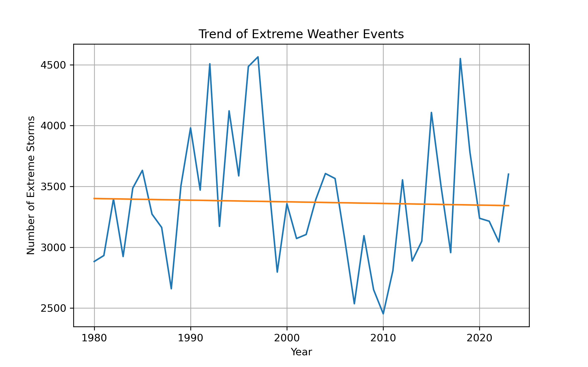
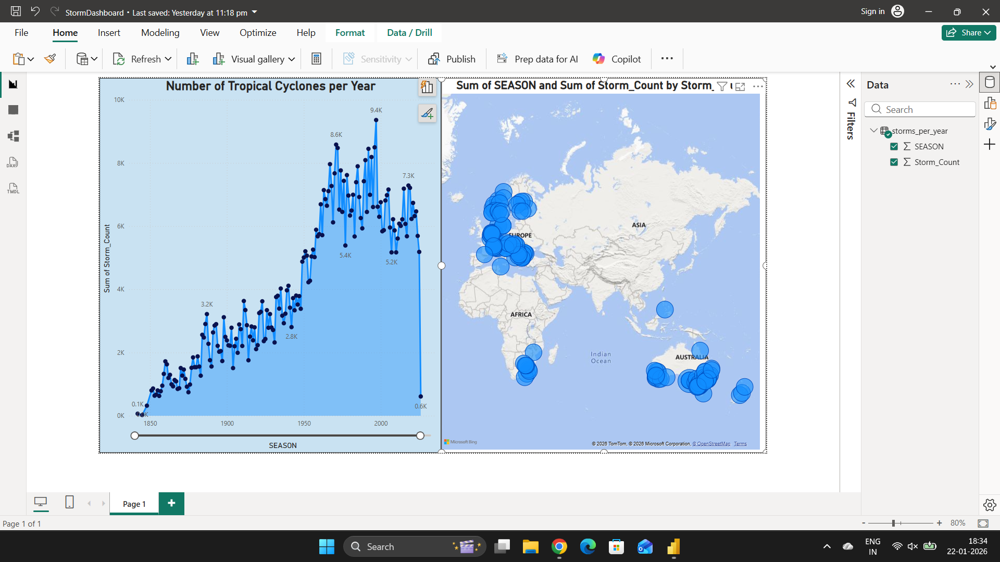
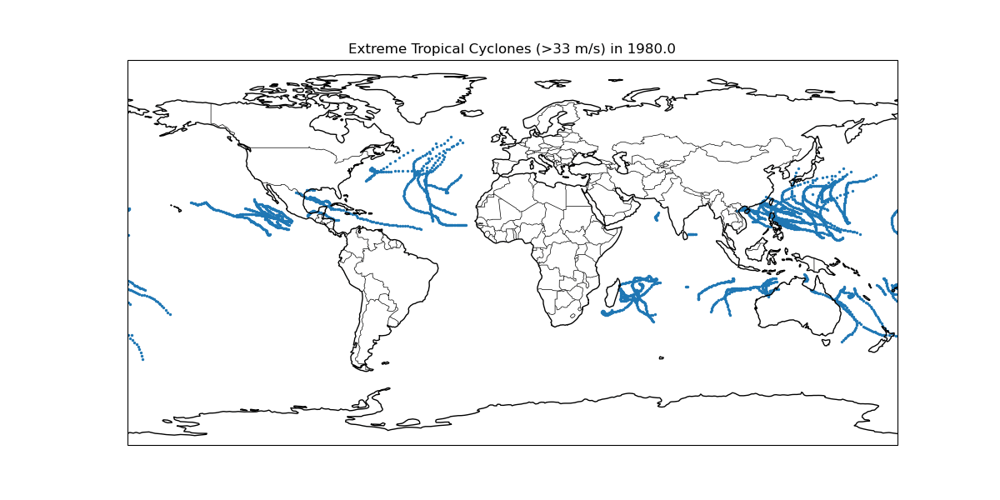

# 🌍 Extreme Weather Events Analysis

## 📌 Overview
This project analyzes historical extreme weather events (tropical cyclones) using Python and scientific computing libraries. The objective is to identify temporal trends, seasonal patterns, and variations in storm activity.

---

## 🛠️ Tools & Technologies
- Python (Pandas, NumPy, SciPy)
- Matplotlib
- Power BI
- Jupyter Notebook

---

## 📂 Dataset
- **Source:** IBTrACS Global Tropical Cyclone Dataset  
- **File:** ibtracs.ALL.list.v04r01.csv  
- **Link:** https://www.ncei.noaa.gov/data/international-best-track-archive-for-climate-stewardship-ibtracs/v04r01/access/csv/  

**Note:** The dataset is not included in this repository due to its large size. Please download it from the official source.

---

## 🔍 Analysis Performed
- Data cleaning and preprocessing  
- Exploratory Data Analysis (EDA)  
- Time-series analysis of storm frequency  
- Statistical analysis of weather parameters  
- Data visualization using Python and Power BI  

---

## 📊 Key Insights
- Extreme weather events show seasonal patterns  
- Storm activity varies across different time periods  
- Certain regions experience higher cyclone frequency  
- Storm intensity shows variation over time  

---

## 📸 Visualizations

### 📈 Trend of Extreme Weather Events


### 📊 Power BI Dashboard Preview


### 🌪️ Cyclone Path Visualization


---

## 📊 Power BI Dashboard
- File: 'powerbi/StormDashboard.pbix.'
- Download and open in Power BI Desktop to explore the interactive dashboard  
- Preview available in the images section above  

---

## 📄 Project Report
A detailed report is available:

📄 extreme_events.pdf

---

## ▶️ How to Run
1. Install required libraries:
   ```bash
   pip install pandas numpy scipy matplotlib
